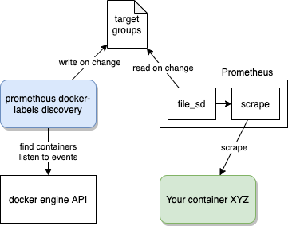

# Discover docker containers to scrape based on labels

This tool aims at discovering containers running
with `prometheus.io/scrape=true` annotations
from a given docker engine, and autoconfigure Prometheus for scraping.

This tool is standalone and write the discovered containers (services) in a file,
which is in turn passed to Prometheus file service discovery to start the scraping jobs.



## Example via a docker-compose

The following part is giving a complete example of configuring the docker-labels discovery mechanism.
It is based in three parts, namely:

- Configure prometheus-docker-labels-discovery
- Configure Prometheus file_sd_configs
- Configure your services

### Configure prometheus-docker-labels-discovery

```yaml
services:
  prometheus-docker-labels-discovery:
    image: ghcr.io/0rax/prometheus-docker-labels-discovery:v1
    restart: unless-stopped
    networks:
      - monitoring_default # make sure this network exists and is connected to prometheus
    #    ports:
    #      - "8080"
    security_opt:
      - no-new-privileges:true
    volumes: # Mount the JSON file that will be exchanged with prometheus
      - ./from-docker-labels.json:/tmp/from-docker-labels.json
    environment:
      - PROMETHEUS_CONFIG_FILE_PATH=/tmp/from-docker-labels.json
      - DOCKER_NETWORK_NAME=bridge
      - PROMETHEUS_COMMON_LABELS=commonlabel1=commonvalue1
```

### Configure Prometheus

Prometheus needs to be configured using [file_sd_configs](https://prometheus.io/docs/prometheus/latest/configuration/configuration/#file_sd_config)
scrape config.

```yaml
scrape_configs:
  - job_name: "docker-labels-sd"
    file_sd_configs:
      - files:
          - "from-docker-labels.json"
```

### Configure your services

Any service can now be configured using [docker labels](https://docs.docker.com/config/labels-custom-metadata/).
The following example shows in docker-compose style how this looks like:

```yaml
services:
  test-metrics:
    image: dummy-metrics:v1
    labels:
      - "prometheus.io/scrape=true"
      - "prometheus.io/path=/metrics"
      - "prometheus.io/extra-labels=k1:v1,k2:v2"
```

The exhaustive list of labels to configure properly your service is provided below:

| Annotation                   | Definition                                                                                                                           | Example                                                      |
| ---------------------------- | ------------------------------------------------------------------------------------------------------------------------------------ | ------------------------------------------------------------ |
| `prometheus.io/scrape`       | Main label to ensure this container will be scraped by Prometheus. Required value is `true`. Any other value will not be considered. | `prometheus.io/scrape=true`                                  |
| `prometheus.io/port`         | Specify which port to use for the scraping. In case of a single port exposed, this configuration can be omitted.                     | `prometheus.io/port=8080`                                    |
| `prometheus.io/path`         | Alternative path for scraping the metrics. Default from Prometheus is `/`.                                                           | `prometheus.io/path=/metrics`                                |
| `prometheus.io/scheme`       | Alternative scheme for scraping the metrics. Default from Prometheus is `http`.                                                      | `prometheus.io/scheme=https`                                 |
| `prometheus.io/extra-labels` | Any extra labels to add to the metrics scraped for this container. Comma separated key:value pairs.                                  | `prometheus.io/extra-labels=label1:value1,label2:value2,...` |
